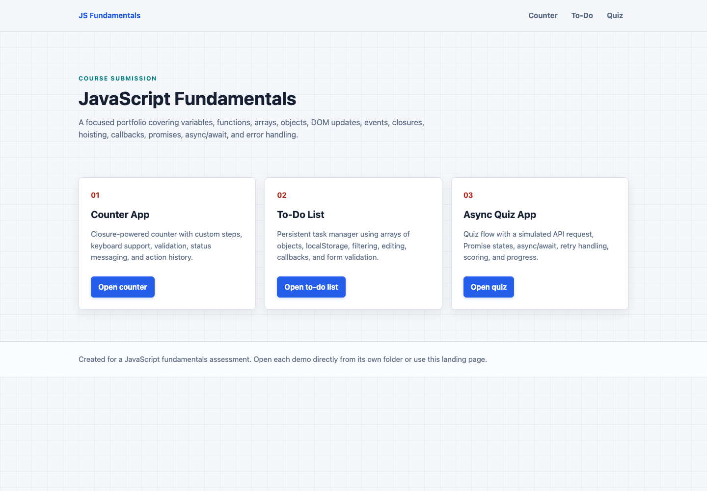
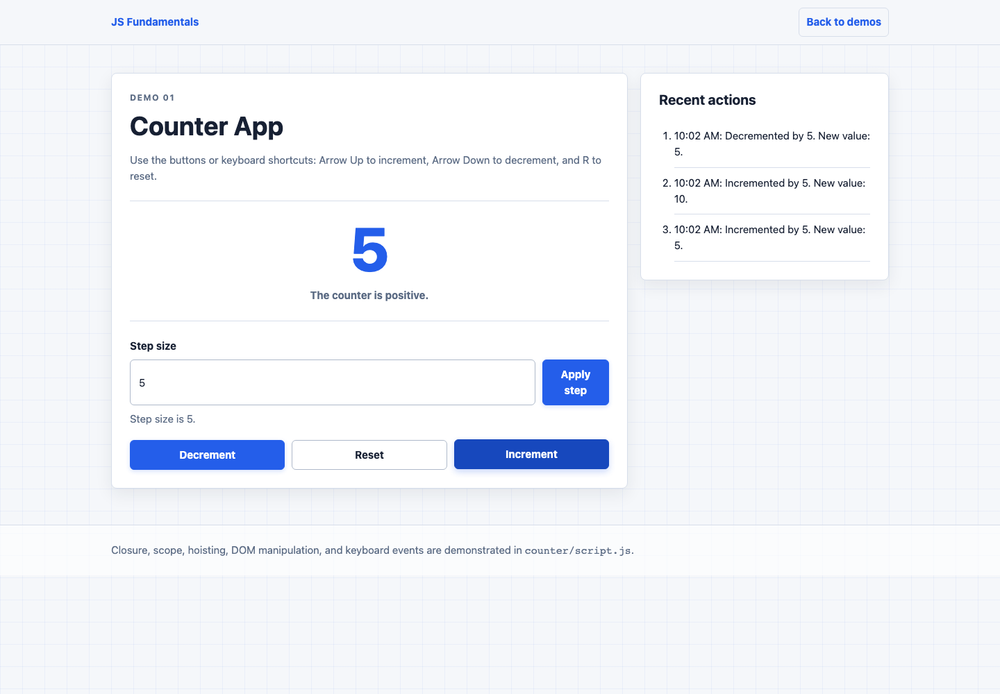
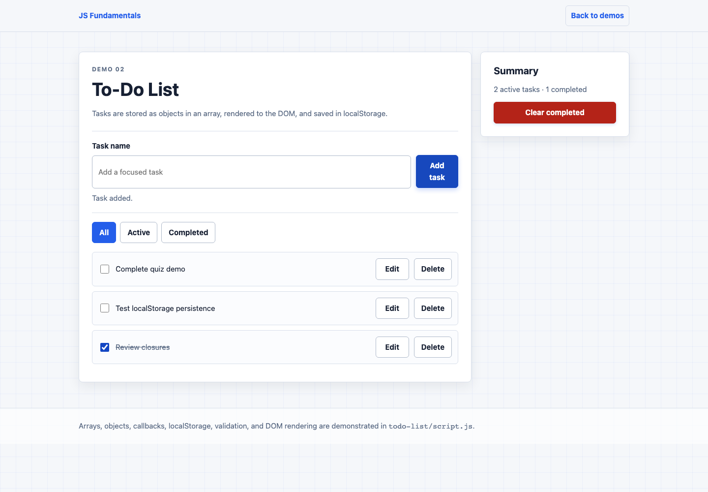
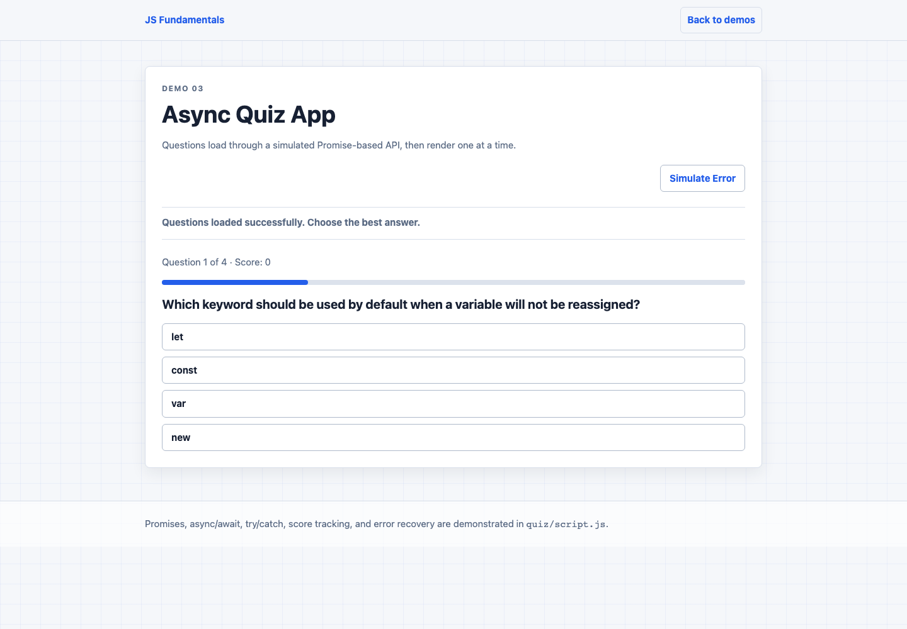

# JavaScript Fundamentals Portfolio

## Overview

This repository contains three responsive, accessible browser demos built with semantic HTML, CSS, and vanilla JavaScript. Together they demonstrate core language concepts, DOM interaction, local persistence, and asynchronous programming without frameworks, packages, or build tools.

## Project Links

- **Repository:** [github.com/Asad2512-dev/Js-fundamentals](https://github.com/Asad2512-dev/Js-fundamentals)
- **Live demo:** GitHub Pages is not enabled. Enable Pages from the `main` branch to publish at `https://asad2512-dev.github.io/Js-fundamentals/`.

## Screenshots

### Landing Page



### Counter App



### To-Do List



### Async Quiz App



## Folder Structure

```text
Js-fundamentals/
├── README.md
├── TESTING.md
├── index.html
├── styles.css
├── assets/
│   ├── counter-app.png
│   ├── landing-page.png
│   ├── quiz-app.png
│   └── todo-list.png
├── counter/
│   ├── index.html
│   ├── style.css
│   └── script.js
├── todo-list/
│   ├── index.html
│   ├── style.css
│   └── script.js
└── quiz/
    ├── index.html
    ├── style.css
    └── script.js
```

## Setup and Usage

1. Clone or download the repository.
2. Open `index.html` in a modern browser.
3. Follow the landing-page links to each demo.

Every demo also works when its own `index.html` file is opened directly. No installation, local server, external library, or build step is required.

## Features

### Counter App

- Increment, decrement, and reset buttons
- Custom whole-number step from 1 to 100
- Accessible invalid-input feedback
- Positive, negative, and zero status messages
- Arrow Up, Arrow Down, and R keyboard shortcuts
- Six-entry recent action history
- Private counter state implemented with a closure
- Intentional scope and hoisting demonstrations

### To-Do List

- Add, inline edit, delete, and complete tasks
- All, active, and completed filters
- Clear all completed tasks
- Active and completed task summary
- localStorage save and restore with guarded error handling
- Empty add and edit validation
- Tasks represented as objects in an array
- Practical use of `map`, `filter`, `find`, `forEach`, and `reduce`
- Reusable callback and button helpers

### Async Quiz App

- Promise-based simulated API using `setTimeout`
- Visible loading, success, failure, and retry states
- Assessor-facing **Simulate Error** button
- `async/await` with `try/catch/finally`
- Protection against stale overlapping requests
- One accessible question at a time
- Semantic progress element, score tracking, and answer feedback
- Locked answers to prevent duplicate scoring
- Final results and restart flow

## Requirements Coverage

| Requirement | Exact file | Function or implementation |
|---|---|---|
| Variables and data types | `counter/script.js`, `todo-list/script.js`, `quiz/script.js` | `stepSize`, `actionHistory`, `tasks`, `questionBank`, `score`, booleans, strings, arrays, and objects |
| Functions | All JavaScript files | `createCounter`, `renderTasks`, `loadQuestions`, `renderResults` |
| Arrays and objects | `todo-list/script.js`, `quiz/script.js` | `tasks`, `createTask`, `questionBank`, `getVisibleTasks` |
| DOM manipulation | All JavaScript files | `updateCounterDisplay`, `renderHistory`, `renderTasks`, `renderQuestion` |
| Event handling | All JavaScript files | `handleKeyboardShortcuts`, `handleTaskSubmit`, `handleAnswer`, and `addEventListener` calls |
| Global, function, and block scope | `counter/script.js` | `demonstrateScope` reads the browser-global `window`, then uses function- and block-scoped constants |
| Closures | `counter/script.js` | `createCounter` keeps `count` private inside returned methods |
| Hoisting | `counter/script.js` | `demonstrateHoisting` calls `declaredBeforeDefinition` before its declaration |
| Callbacks | `counter/script.js`, `todo-list/script.js` | `handleCounterAction`, `applyToTasks`, `createTaskButton`, array callbacks, and event callbacks |
| Promises | `quiz/script.js` | `simulateQuestionRequest` constructs and resolves or rejects a `Promise` |
| async/await | `quiz/script.js` | `loadQuestions` awaits `simulateQuestionRequest` |
| Error handling | `todo-list/script.js`, `quiz/script.js` | `loadTasksFromStorage`, `saveTasksToStorage`, `loadQuestions`, `showErrorState` |
| localStorage | `todo-list/script.js` | `loadTasksFromStorage` and `saveTasksToStorage` |
| Accessibility | All HTML and CSS files | Semantic landmarks, labels, live regions, progress semantics, focus states, and accessible names |
| Responsive design | `styles.css` and demo stylesheets | Flexible grids and breakpoints tested from 320px through 1440px |
| Three interactive demos | `counter/`, `todo-list/`, `quiz/` | All three demos provide complete interactive workflows |

## Concept Explanations

### Variables and Data Types

The scripts use `const` unless a binding must change, in which case they use `let`. Examples include numbers (`stepSize`, `score`), strings (titles and messages), booleans (`isComplete`, `hasAnsweredCurrentQuestion`), arrays (`tasks`, `questionBank`, `actionHistory`), objects (task and question records), and `null` (`editingTaskId`).

### Functions

Named functions divide each workflow into focused units. For example, `validateStepValue` validates counter input, `renderTasks` builds the task-list DOM, and `loadQuestions` controls asynchronous quiz loading. Small event callbacks connect these functions to user actions.

### Arrays and Objects

Each to-do is an object with `id`, `title`, `isComplete`, and `createdAt`. Each quiz question is an object with `question`, `answers`, and `correctIndex`. The apps process arrays with `map`, `filter`, `find`, `forEach`, and `reduce` instead of manually managing indexes where an array method is clearer.

### DOM Manipulation

The apps select existing elements with `querySelector` and `querySelectorAll`. They update text and attributes, toggle classes, replace children, and create interactive elements with `document.createElement`. User content is assigned through `textContent`, avoiding HTML injection.

### Event Handling

Forms, buttons, checkboxes, filters, and keyboard shortcuts use `addEventListener`. Handlers prevent invalid submissions, update application state, save data when necessary, and then render the current state back into the DOM.

### Callbacks

Callbacks are used by event listeners and array methods. `applyToTasks(callback)` accepts a transformation callback and applies it with `map`. `handleCounterAction(actionName, actionCallback)` receives one of the closure's methods and runs it for the selected action.

### Scope

`demonstrateScope` safely reads the browser-global `window` object, declares `globalScopeValue` within the demonstration, creates `functionScopeValue` inside a nested function, and creates `blockScopeValue` inside an `if` block. The application itself is wrapped in an IIFE, so it does not add custom variables to the global namespace.

### Closures

`createCounter` declares a private `count` variable and returns methods that continue to access it after `createCounter` finishes. The UI can increment, decrement, reset, or read the value, but it cannot overwrite `count` directly.

### Hoisting

`demonstrateHoisting` successfully calls the function declaration `declaredBeforeDefinition` before its source definition because function declarations are hoisted with their implementation. `let` and `const` declarations are also hoisted, but accessing them before initialization throws a `ReferenceError` because they remain in the temporal dead zone. The demo explains this safely without executing broken code.

### Promises

`simulateQuestionRequest` returns a `Promise`. After a 700ms `setTimeout`, it either resolves with cloned question data or rejects with an `Error` when failure simulation is enabled.

### async/await

`loadQuestions` uses `await` inside `try/catch/finally`. It shows loading first, waits for the Promise, renders questions on success, renders a retry control on failure, and restores the error-test control when the latest request finishes.

### Error Handling

The quiz catches rejected Promise errors and displays recoverable feedback instead of throwing an uncaught exception. The to-do app guards both JSON parsing and localStorage writes, falls back safely, and announces a useful message if browser storage is unavailable.

### localStorage

The to-do list converts the task array to JSON with `JSON.stringify` before saving it. On startup, it parses stored JSON, verifies that the result is an array, filters out malformed entries, and renders the valid tasks.

## Accessibility Notes

- Semantic header, navigation, main, section, article, aside, form, list, and footer elements define page structure.
- Every form input has a visible label and an `aria-describedby` feedback relationship.
- Dynamic feedback uses polite or assertive `aria-live` regions.
- Quiz answers are an accessible named group, and progress uses a native `<progress>` element.
- Dynamically rendered quiz headings receive focus when the view changes.
- Filter state is exposed with `aria-pressed`; task controls include task-specific accessible names.
- Keyboard users receive a high-contrast focus indicator on every interactive control.
- Text, controls, success, danger, and focus colors have strong visual contrast.
- Reduced-motion preferences remove nonessential transitions.

## Testing

The complete results are recorded in [TESTING.md](TESTING.md). Automated browser QA covered all features, console errors, keyboard focus, localStorage persistence, asset responses, and layouts at 320px, 768px, 1024px, and 1440px. The final run completed with **21 passed tests and 0 failures**.

## Known Limitations

- Quiz data is local and the API delay is simulated; no network service is required.
- To-do data belongs to one browser and device because localStorage does not synchronize.
- Clearing browser site data removes saved tasks.

## Future Improvements

- Add optional quiz categories and randomized question order.
- Add task due dates while keeping the current simple workflow.

## Author

**Muhammad Asad Ullah**  
GitHub: [@Asad2512-dev](https://github.com/Asad2512-dev)
